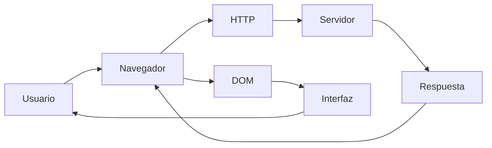
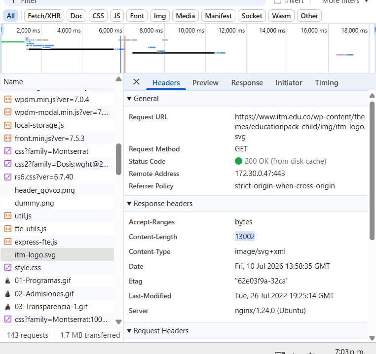
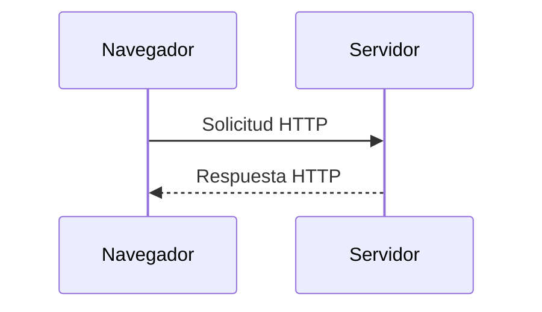
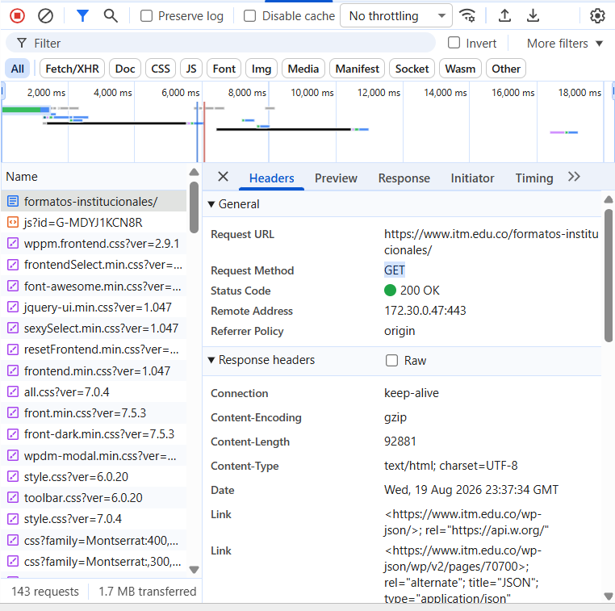
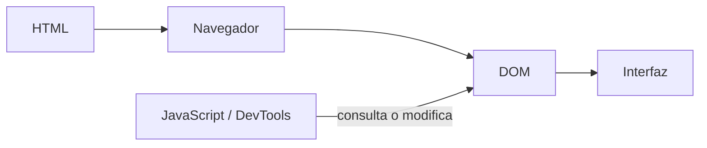
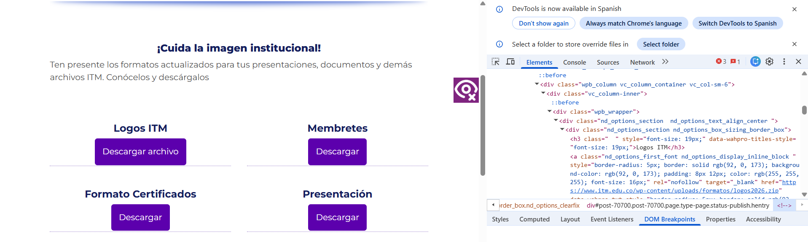
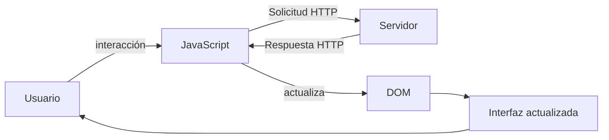
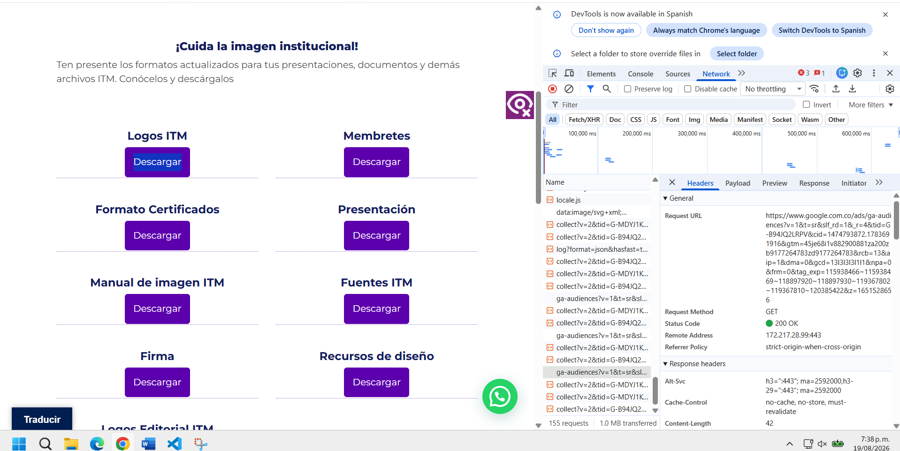
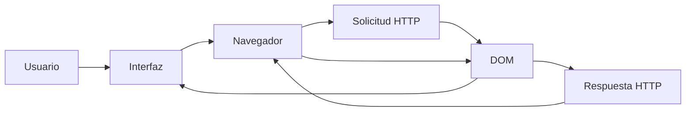

# Laboratorio 01 --- Análisis del funcionamiento de una aplicación web

> **Curso:** Aplicaciones y Servicios Web\
> **Modalidad:** Práctica de laboratorio\
> **Entrega:** Repositorio GitHub --- archivo `README.md`\
> **Evidencias:** Carpeta `evidencias/`

------------------------------------------------------------------------

## Objetivo de la práctica

Analizar el funcionamiento de una aplicación web real mediante las
herramientas de desarrollo del navegador, identificando los recursos
cargados, las solicitudes y respuestas HTTP, la estructura DOM y las
interacciones entre cliente y servidor.

## Resultado esperado

Al finalizar la práctica, el estudiante deberá poder reconstruir y
documentar el flujo observado entre:



> El diagrama anterior representa los **componentes que serán
> analizados**. El diagrama final de la práctica deberá ser construido
> por el estudiante a partir de sus propias observaciones.

------------------------------------------------------------------------

# 1. Preparación del entorno

1.  Ingrese a la aplicación web indicada por el docente.
2.  Abra las **herramientas de desarrollo** del navegador.
3.  Identifique las herramientas **Red / Network** y **Elementos /
    Elements**.
4.  Cree la siguiente estructura dentro del repositorio:

``` text
laboratorio-01/
├── README.md
└── evidencias/
```

El archivo `README.md` será el informe de la práctica. La carpeta
`evidencias/` contendrá las capturas utilizadas para sustentar los
resultados.

------------------------------------------------------------------------

# 2. Identificación de recursos de la aplicación

Abra la herramienta **Red / Network** y recargue completamente la
aplicación.

Observe las solicitudes generadas durante la carga e identifique como
mínimo **cinco recursos**, procurando seleccionar tipos diferentes:
documento HTML, CSS, JavaScript, imágenes, fuentes u otros.

## Resultados

Complete la tabla:

  Recurso                       Tipo      Dominio             Tamaño
  ---------                     ------    ---------           --------
   formatos-institucionales/   Documento  itm.edu.co           92881
   js?id=G-MDYJ1KCN8R          script     googletagmanager.com 169423
   frontend.min.css?ver=1.047  stylesheet www.itm.edu.co       7231       
   header_govco.png            png        css.mintic.gov.co    13.3kB
   itm-logo.svg                svg+xml    www.itm.edu.co       13002


**Total de solicitudes observadas:** `143`

## Evidencia

Guarde una captura de la pestaña Network como:

``` text
evidencias/network.png
```

Inclúyala aquí:

``` markdown

```

### Análisis

**¿Por qué una sola URL puede generar múltiples solicitudes HTTP?**

> porque dentro tiene una pagina html que para funcionar solicita mas recursos.
 
------------------------------------------------------------------------

# 3. Análisis de una solicitud HTTP

En **Network**, seleccione una de las solicitudes realizadas por el
navegador, preferiblemente la correspondiente al documento principal.

Identifique la información solicitada a continuación.

  Elemento              Resultado
  --------------------- -----------
  URL                   https://www.itm.edu.co/formatos-institucionales/
  Método HTTP           GET
  Código de estado      200 OK
  Host / dominio        itm.edu.co
  Tipo de recurso       document
  Tiempo de respuesta   1.41 s
  --------------------- -----

## Flujo que se está observando



## Evidencia

Guarde una captura de los detalles de la solicitud como:

``` text
evidencias/request.png
```

Inclúyala en el informe:

``` markdown

```

### Análisis

**¿Qué recurso solicitó el navegador?**

> Una pagina web contine los formatos institucionales.

**¿Qué información permite determinar si la solicitud fue atendida
correctamente?**

> Su codigo de respuesta que es 200 OK.

------------------------------------------------------------------------

# 4. Inspección del DOM

Seleccione un elemento visible de la aplicación, por ejemplo:

-   un botón;
-   un título;
-   un enlace;
-   un campo de formulario;
-   un elemento del menú.

Utilizando **Elementos / Elements**:

1.  Localice el elemento dentro del DOM.
2.  Identifique la etiqueta HTML utilizada.
3.  Modifique temporalmente su contenido desde las herramientas de
    desarrollo.
4.  Observe el cambio producido en la interfaz.
5.  Registre la evidencia.

## Resultados

**Elemento seleccionado:** `Boton`

**Etiqueta HTML:** `<a </a>`

**Contenido original:** `Descargar`

**Modificación realizada:** `Descargar Archivo`

El proceso observado puede representarse conceptualmente así:



## Evidencia

Guarde la captura como:

``` text
evidencias/dom.png
```

Inclúyala aquí:

``` markdown

```

### Análisis

**¿La modificación realizada sobre el DOM alteró permanentemente la
aplicación o los archivos almacenados en el servidor? Justifique.**

> La modificación no es permanente debido a que se guarda hasta que se recarga la pagina al hacerlo vuelve a sus valores originales.

------------------------------------------------------------------------

# 5. Análisis de una interacción dinámica

Regrese a **Network** y limpie las solicitudes registradas.

Realice una acción dentro de la aplicación que pueda generar una
interacción con el servidor, por ejemplo:

-   consultar;
-   buscar;
-   filtrar;
-   seleccionar una opción;
-   enviar información.

Observe si aparece una nueva solicitud en Network.

## Resultados

  Elemento                       Resultado
  ------------------------------ -----------
  Acción realizada               Mostrar una venta emergente de whatsapp         
  ¿Generó una nueva solicitud?   No
  URL solicitada                 data:image/svg+xml;charset=utf-8,%3Csvg xmlns='http://www.w3.org/2000/svg' fill='%23fff' viewBox='0 0 24 24'%3E%3Cpath d='M24 2.4 21.6 0 12 9.6 2.4 0 0 2.4 9.6 12 0 21.6 2.4 24l9.6-9.6 9.6 9.6 2.4-2.4-9.6-9.6z'/%3E%3C/svg%3E
  Método HTTP                    GET
  Código de estado               200 OK
  Tipo de respuesta              Mostrar informacion

## Ciclo de interacción

Utilice este esquema únicamente como referencia conceptual para
interpretar lo observado:



## Evidencia

Guarde la captura como:

``` text
evidencias/interaccion.png
```

Inclúyala aquí:

``` markdown

```

### Análisis

**Explique la relación entre la acción realizada por el usuario y la
solicitud observada.**

> Al momento de dar clik en el boton se dispara una solicitud al sistema que pedi descargar un archivo y el lo descarga automaticamente.

------------------------------------------------------------------------

# 6. Reconstrucción del flujo observado

A partir de **sus propias evidencias**, construya un diagrama Mermaid
que represente el funcionamiento de la aplicación analizada.

El diagrama deberá incluir, cuando corresponda:

`Usuario` · `Navegador` · `JavaScript` · `Solicitud HTTP` · `Servidor` ·
`Respuesta HTTP` · `DOM` · `Interfaz`

> **No copie los diagramas anteriores.** Esta sección debe representar
> el flujo que usted pudo comprobar durante la práctica.

Reemplace el siguiente bloque con su diagrama:



------------------------------------------------------------------------

# 7. Observado vs. inferido

Una herramienta de desarrollo permite observar una parte del sistema,
pero no necesariamente todo lo que ocurre en el servidor.

Clasifique sus hallazgos:

## Elementos observados directamente

- Las solicitudes que hace la pagina en cada interacción   
- Tipos de recursos que se cargan en la pagina como html 
- elementos extra de todas las solicitudes como su estado, tiempo, tamaño etc  

## Elementos inferidos

- llamado que hace el servidor para ejectar las solictudes  
- actualización de datos en la interfaz  
- como el servidor organiza la informacion para poder mandarla  

> No presente como observado un proceso interno que las herramientas del
> navegador no permitan comprobar directamente.

------------------------------------------------------------------------

# 8. Conclusiones

Redacte **tres conclusiones técnicas** derivadas de la práctica.

1. Conocer la herramientas de desarrollador de f12 ayuda a resolver problemas tecnicos y validar como llega la informacion de la pagina
2. Saber el flujo correcto con el cual se dispone una aplicacion evita cometer errores y tambien solucionarlos de una forma rapida y precisa 
3. Entender los conceptos de peticiones ayuda a distinguir ciertas peticiones de otras para revisar su funcionamiento determinando si estan bien o no 

Las conclusiones deben explicar lo aprendido a partir de la evidencia y
no limitarse a describir las actividades realizadas.

------------------------------------------------------------------------

# 9. Entrega

La estructura final esperada es:

``` text
laboratorio-01/
├── README.md
└── evidencias/
    ├── network.png
    ├── request.png
    ├── dom.png
    └── interaccion.png
```

Antes de entregar, verifique:

-   [ ] El `README.md` se visualiza correctamente en GitHub.
-   [ ] Las imágenes se muestran dentro del README.
-   [ ] Se documentaron al menos cinco recursos.
-   [ ] Se analizó una solicitud HTTP.
-   [ ] Se identificó y modificó un elemento del DOM.
-   [ ] Se analizó una interacción de la aplicación.
-   [ ] El diagrama final corresponde a lo observado.
-   [ ] Se diferenciaron elementos observados e inferidos.
-   [ ] Se redactaron tres conclusiones técnicas.
-   [ ] Se realizó `commit` y `push` al repositorio.

------------------------------------------------------------------------

## Criterio de documentación

> **Las capturas son evidencia, no la respuesta.**

Cada evidencia debe estar acompañada por una explicación que indique
**qué se observó, qué significa y cómo se relaciona con el
funcionamiento de la aplicación web**.
